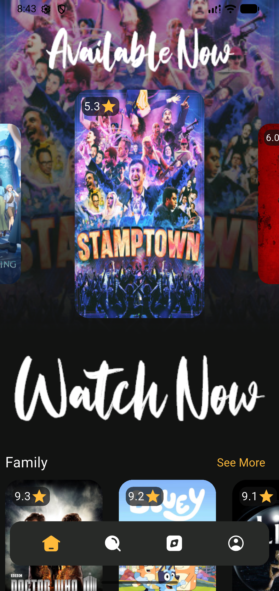
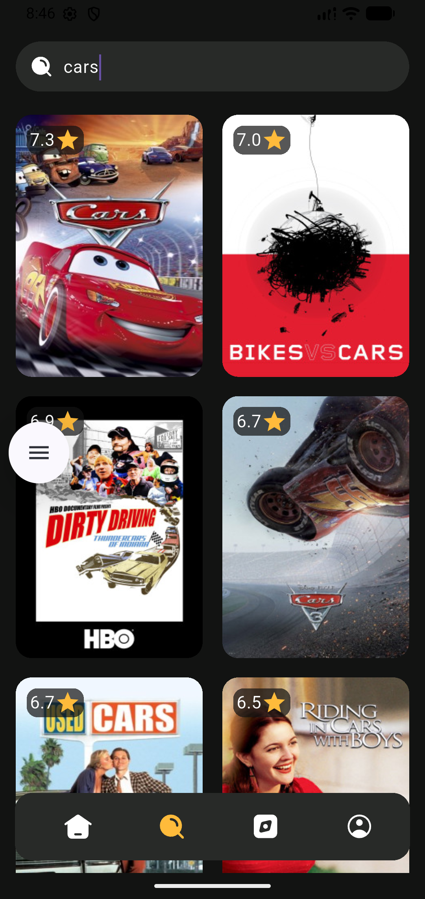
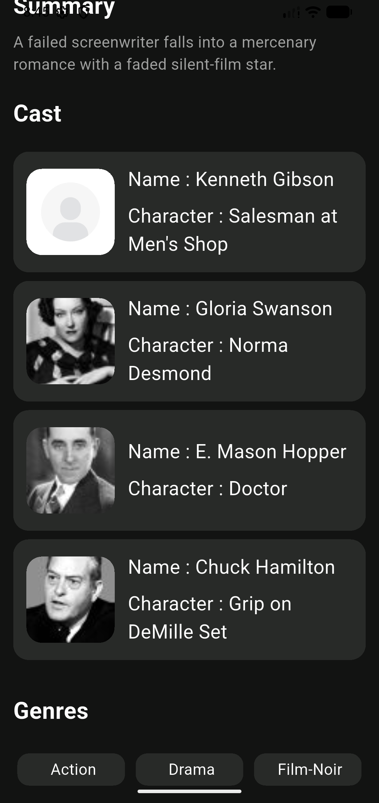
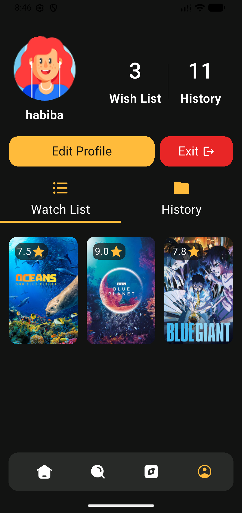
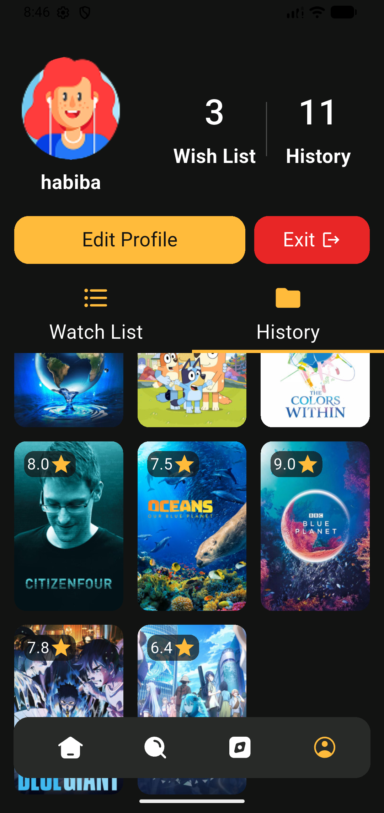

#  Movies App

A Flutter movies application built with **The Movie DB / YTS API**, allowing users to browse, search, and save their favourite movies, with a full authentication flow and profile management.

## Features

- **Onboarding & Splash** – Animated intro flow for first-time users.
- **Authentication** – Login, Register, and Forget Password with Firebase Auth.
- **Home Tab** – Trending & categorized movie listings with "See More" navigation into Browse.
- **Browse Tab** – Genre-based browsing with dynamic chip selection.
- **Search Tab** – Real-time movie search.
- **Movie Details** – Full movie info screen (rating, overview, cast, etc.).
- **Profile Tab**
  - **Watch List** – Firestore-backed favourites, synced per user.
  - **History** – Tracks recently viewed movies, synced per user via Firestore.
  - **Update Profile** – Edit user info and avatar.

##  Tech Stack

| Layer | Tools / Packages |
|---|---|
| Language & Framework | Flutter / Dart |
| State Management | `flutter_bloc` (Cubit pattern) |
| Dependency Injection | `get_it` + `injectable` (with `build_runner` code generation) |
| Backend / Auth | Firebase Auth, Google Sign-In |
| Database | Cloud Firestore (Watch List & History) |
| Networking | Dio, custom `ApiManager` abstraction |
| Movies Data | YTS Movies API |

##  Architecture Notes

- Uses the **Cubit pattern** for state management across all features, keeping UI reactive and logic testable.
- Dependency injection is handled via `get_it` + `injectable`; shared/singleton Cubits (like the Watch List Cubit) are registered with `@lazySingleton` and provided via `BlocProvider.value` to avoid premature disposal.
- Firestore documents store only **movie IDs** (not full objects) to keep the Watch List lean — full movie data is fetched separately when needed.
- Deliberately avoids over-engineering: no Repository layer was introduced, keeping the data flow simple and direct between Cubits and data sources.
- Widget identity issues (e.g. switching between similar tabs) are handled using `ValueKey` to force fresh state where needed.

##  Screenshots

| | | |
|---|---|---|
|  |  |  |
| Login | Login Success | Home |
|  |  |  |
| Home | Browse | Search |
|  |  |  |
| Movie Details | Movie Details | Profile |
|  | | |
| History | | |

##  Team & Contributions

| Member | Contributions |
|---|---|
| **Habiba Fadel** | Login UI + Register UI + Forget Password UI + Home Tab logic + Login logic + Profile Tab logic |
| **Sulaf Amer** | Home Tab UI + Browse Tab UI + Movie Details UI & logic + Forget Password logic + Browse Tab logic |
| **Nour Mohamed** | Update Profile UI + Search Tab UI + Update Profile logic + Search Tab logic + Register logic |
| **Serag Abdulhaleem** | Splash Screen UI + Onboarding Screen UI |
| **Ahmed Abdulnasser** | Profile Tab UI |

##  Getting Started

```bash
flutter pub get
flutter pub run build_runner build --delete-conflicting-outputs
flutter run
```